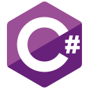

# Hello, I'm Thomas Parker 👋
## BSc Computer Science student at [The University of Manchester][university] 🎓

- 💻 Currently learning full stack web development
- ❤️ Love entrepreneurship, working out, reading, content creation, gaming, investing and development
- 🤝 Always looking for others to collaborate with
- 🎯 Trying to improve myself every single day
- 😊 Happy to answer any questions
- 📧 thomasbeparker@gmail.com

### Social media

&nbsp;&nbsp;

&nbsp;&nbsp;

&nbsp;&nbsp;

&nbsp;&nbsp;

### Languages and tools

[university]: https://www.manchester.ac.uk/
